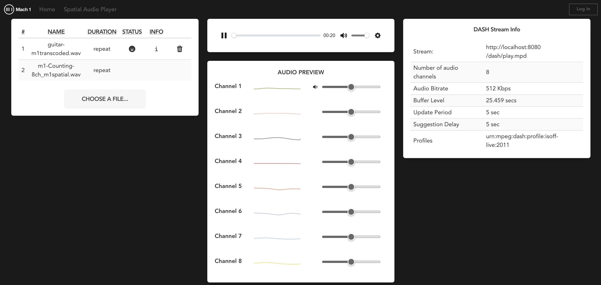
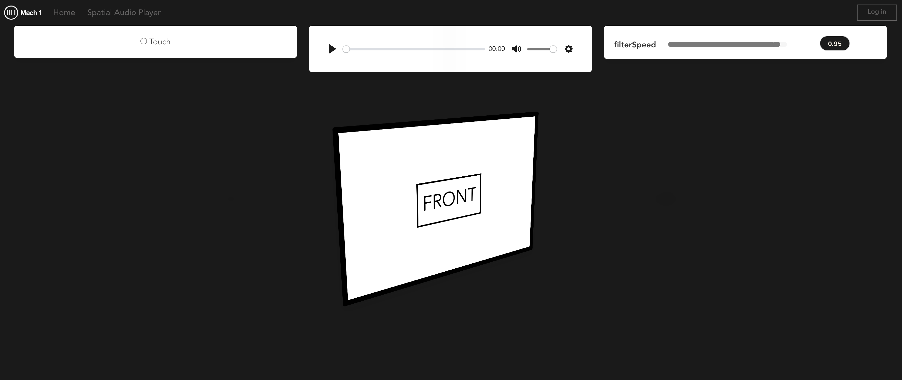
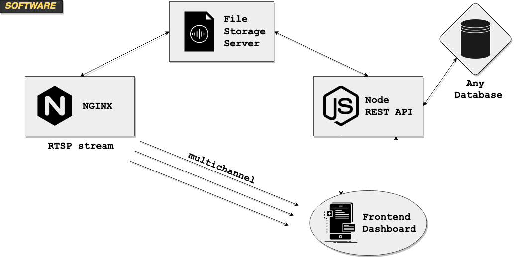

# m1-spatialaudioplayer-app
Frontend &amp; Backend for serving custom streaming spatial audio players

### Setup
Use nvm to setup node `14.16.0`:
- `nvm install 14.16.0`
- `nvm use 14.16.0`

- `cd containers` && `docker build -t m1-transcode .`
- `cd koa-server` && `npm i && npm run local`
- `cd vue-front` && `npm i && npm run build`

#### Run locally
```
docker run -it \
  -p 1935:1935 \
  -p 8080:80 \
  --mount type=bind,source="$(pwd)/koa-server/public",target=/share/sound \
  --mount type=bind,source="$(pwd)/vue-front/dist",target=/www \
  --name m1-transcode \
  --rm m1-transcode
```

### Usage
Quickly build and deploy hosted spatial audio experiences & streams designed around Mach1 Spatial and leveraging the Mach1Decode API & Mach1Transcode API to unify playback of all multichannel and spatial audio formats.

#### Admin Page
This page is designed for administration over spatial mixes to easily allow users to upload and manage playlists.



#### Spatial Player Page
This page acts as a template for the client playback, it will play any existing streams or uploaded content from the Admin Page and is based on https://github.com/Mach1Studios/m1-web-spatialaudioplayer



### Development
_This repo is still in development and is deemed experimental and unstable until further notice._

#### To Do:
- Mach1Transcode audio transcoding support
- Playlisting support
- Https deployment
- User / Group handling

#### Software Design
